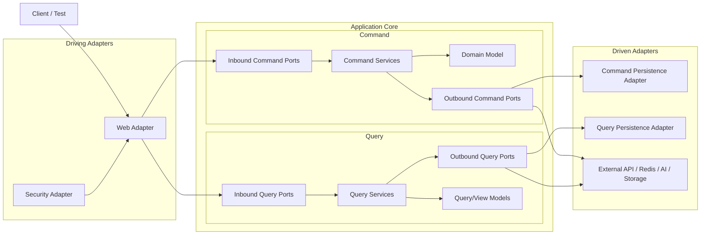

# 🏡 Air-Trip 프로젝트

<table>
  <tr>
    <td width="65%">
      <h3>숙소 탐색부터 예약까지 이어지는 여행 숙박 플랫폼</h3>
      <h4>프로젝트 소개</h4>
      <p>Air Trip은 여행자가 원하는 숙소를 빠르게 찾고, 관심 있는 숙소를 위시리스트에 저장한 뒤 예약과 결제까지 한 번에 진행할 수 있는 서비스입니다.
        사용자는 숙소 상세 정보와 리뷰를 확인하며 더 쉽게 숙소를 비교할 수 있고, 실시간 채팅을 통해 여행 동행자와 소통할 수 있습니다. 또한 AI 추천 챗봇을 통해 조건에 맞는 숙소를 더 편리하게 찾아볼 수 있습니다.
      </p>
      <h4>개발 목적</h4>
      <p>숙박 플랫폼의 핵심 흐름인 숙소 탐색, 위시리스트, 예약, 결제, 리뷰, 채팅, AI 추천을 하나의 서비스로 연결해 실제 서비스에 가까운 백엔드 구조를 설계하고 구현하는 것을 목표로 했습니다.
        또한 도메인 중심 설계와 헥사고날 아키텍처를 적용해 유스케이스, 포트, 어댑터를 분리하고, 인증, 결제, 캐시, 메시징, AI 연동 같은 외부 의존성을 애플리케이션 코어와 분리하는 데 중점을 두었습니다.
      </p>
    </td>
    <td width="35%" align="center">
      
      <br />
      
[](https://myhits.vercel.app)


[](https://www.jgy914.shop)
[](https://airbackend.jgy914.shop/api-docs)
    </td>
    
  </tr>
</table>

## ✨ 주요 기능

- 회원가입/로그인, OAuth, JWT 인증
- 숙소 검색, 상세 조회, 위시리스트 관리
- 예약 가능일 확인, 예약 생성, 결제 승인
- 리뷰 작성/수정/삭제 및 내 리뷰 조회
- 실시간 채팅
- AI 기반 숙소 추천 챗봇
- 외부 관광 API 기반 숙소 데이터 동기화

## 🚀 설치 및 실행 방법

```bash
git clone https://github.com/geun-00/Air-Trip.git
cd Air-Trip
```

`spring-boot-docker-compose` 의존성이 설정되어 있어, 개발 환경에서 `bootRun`으로 애플리케이션을 실행할 때 `compose.yml`을 함께 사용할 수 있습니다.

```bash
./gradlew bootRun
```

Docker Compose를 직접 실행하려면 다음 명령을 사용합니다.

```bash
docker compose up -d
```

## 🔐 환경변수

애플리케이션 실행에 필요한 설정은 env 파일로 관리합니다.

| 파일 | 용도 |
| --- | --- |
| `.env` | Docker Compose 실행에 필요한 로컬 인프라 환경변수 |
| `.env.local` | 로컬 애플리케이션 실행 환경변수 |
| `.env.prod` | 운영 환경변수 예시 또는 배포용 환경변수 |

### ✅ Docker Compose 환경변수

`.env`에는 로컬 인프라 컨테이너 실행에 필요한 값을 준비합니다.

```dotenv
MARIADB_ROOT_PASSWORD=
MARIADB_EXPORTER_USER=
MARIADB_EXPORTER_PASSWORD=
MARIADB_DATABASE=

MONGODB_ROOT_USERNAME=
MONGODB_ROOT_PASSWORD=
MONGODB_DATABASE=
```

### ✅ 로컬 환경변수

`.env.local`에는 애플리케이션 실행에 필요한 값을 준비합니다.

```dotenv
# App
BASE_URL=
ADMIN_EMAIL=
ADMIN_PASSWORD=

# Database
DB_URL=
DB_USERNAME=
DB_PASSWORD=

# MongoDB
MONGODB_ROOT_USERNAME=
MONGODB_ROOT_PASSWORD=
MONGODB_DATABASE=

# OAuth
GOOGLE_CLIENT_ID=
GOOGLE_CLIENT_SECRET=
GH_CLIENT_ID=
GH_CLIENT_SECRET=
NAVER_CLIENT_ID=
NAVER_CLIENT_SECRET=
KAKAO_CLIENT_ID=
KAKAO_CLIENT_SECRET=

# JWT
JWT_SECRET_KEY=
JWT_ACCESS_EXP=
JWT_REFRESH_EXP=

# External APIs
TOUR_API_KEY=
REST_DAY_API_KEY=
PAYMENT_SECRET_KEY=
OPENAI_API_KEY=

# Cloudflare R2
R2_ENDPOINT_URL=
R2_PUBLIC_URL=
R2_BUCKET_NAME=
R2_ACCESS_KEY=
R2_SECRET_KEY=
```

### ✅ 운영 환경변수

`.env.prod`에는 외부 인프라 접속 정보와 메일 설정을 추가로 준비합니다.

```dotenv
# App
BASE_URL=
ADMIN_EMAIL=
ADMIN_PASSWORD=

# Database
DB_URL=
DB_USERNAME=
DB_PASSWORD=

# Redis
REDIS_HOST=
REDIS_PORT=
REDIS_PASSWORD=

# MongoDB
MONGODB_HOST=
MONGODB_PORT=
MONGODB_ROOT_USERNAME=
MONGODB_ROOT_PASSWORD=

# Mail
MAIL_HOST=
MAIL_PORT=
MAIL_USERNAME=
GMAIL_SMTP_PWD=

# OAuth
GOOGLE_CLIENT_ID=
GOOGLE_CLIENT_SECRET=
GH_CLIENT_ID=
GH_CLIENT_SECRET=
NAVER_CLIENT_ID=
NAVER_CLIENT_SECRET=
KAKAO_CLIENT_ID=
KAKAO_CLIENT_SECRET=

# JWT
JWT_SECRET_KEY=
JWT_ACCESS_EXP=
JWT_REFRESH_EXP=

# External APIs
TOUR_API_KEY=
REST_DAY_API_KEY=
PAYMENT_SECRET_KEY=
OPENAI_API_KEY=

# Cloudflare R2
R2_ENDPOINT_URL=
R2_PUBLIC_URL=
R2_BUCKET_NAME=
R2_ACCESS_KEY=
R2_SECRET_KEY=
```

### ✅ GitHub Repository Secrets

```dotenv
AWS_REGION=
AWS_ACCESS_KEY_ID=
AWS_SECRET_ACCESS_KEY=
APP_ENV=
```

#### `APP_ENV` 준비 방법

위에 정의한 `.env.prod` 파일을 [Base64](https://www.base64encode.org/ko/)로 인코딩해 `APP_ENV` Secret에 등록합니다.

## ⚙ 기술 스택

### 🧱 Core

<div>
  
  
  
  
  
  
  
</div>

### 🛢️ Database

<div>
  
  
</div>

### 📚 Test & Docs

<div> 
  
  
  
</div>

### 🌐 Infra

<div>
  
  
  
  
  
  
  
  
  
  
</div>

### 🧩 ETC

<div>
  
  
  
  
  
  
  
</div>

## 🏗️ 디렉터리 구조

각 도메인은 헥사고날 아키텍처 스타일로 `domain`, `application`, `adapter`를 나누고, `application` 내부의 인바운드/아웃바운드 포트를 통해 외부 계층과 연결됩니다.

```text
{domain}
├── domain                  # 애그리거트, 엔티티, 값 객체, 도메인 규칙
├── application
│   ├── in                  # 유스케이스 진입 포트
│   ├── out                 # 유스케이스가 필요로 하는 외부 의존 포트
│   └── service             # 유스케이스 구현
└── adapter
    ├── in                  # 외부 요청을 애플리케이션으로 전달하는 인바운드 어댑터
    └── out                 # 외부 시스템과 연결되는 아웃바운드 어댑터
```

### 전체 구조



## 📐 프로젝트 규칙

### ✅ 의존성 규칙

- 전체 의존성은 바깥 계층인 `adapter`에서 안쪽 계층인 `application`, `domain` 방향으로 흐릅니다.
- `domain`은 `application`, `adapter`, `config`, `infrastructure`, `auth` 패키지를 직접 의존하지 않습니다.
- `domain`은 JPA를 제외한 Spring, Redis, Web, Security 같은 외부 프레임워크를 직접 의존하지 않습니다.
- `domain`에는 `@Service`, `@Repository`, `@Component`, `@RestController` 같은 Spring 계층 어노테이션을 붙이지 않습니다.
- `application.service`는 `application.in` 포트를 구현하고, 필요한 외부 기능은 `application.out` 포트를 통해 의존합니다.
- `application` 계층은 `adapter.in`, `adapter.out`, `config`, `infrastructure` 패키지를 직접 의존하지 않습니다.
- `adapter.in`은 `application.in`의 `UseCase` 인터페이스에 의존합니다.
- `adapter.out`은 `application.out`의 `Port` 인터페이스를 구현합니다.
- 상위 패키지 간 순환 의존성을 만들지 않습니다.
- 필드 주입은 사용하지 않고 생성자 주입을 사용합니다.

### ✅ 네이밍 규칙

| 대상 | 위치 | 규칙 |
| --- | --- | --- |
| 커맨드 유스케이스 | `application.in.command` | 인터페이스이며 `UseCase`로 끝납니다. |
| 쿼리 유스케이스 | `application.in.query` | 인터페이스이며 `UseCase`로 끝납니다. |
| 커맨드 아웃 포트 | `application.out.command` | 인터페이스이며 `Port`로 끝납니다. |
| 쿼리 아웃 포트 | `application.out.query` | 인터페이스이며 `Port`로 끝납니다. |
| 커맨드 서비스 | `application.service.command` 또는 `application.service` | `CommandService`로 끝납니다. |
| 쿼리 서비스 | `application.service.query` 또는 `application.service` | `QueryService`로 끝납니다. |
| 웹 어댑터 | `adapter.in.web` | `Controller`로 끝나고 `@RestController`를 사용합니다. |
| 웹 요청 모델 | `adapter.in.web.request` | API 요청 DTO이며 `Request`로 끝납니다. |
| 웹 응답 모델 | `adapter.in.web.response` | API 응답 DTO이며 `Response`로 끝납니다. |
| 애플리케이션 커맨드 모델 | `application.in.command.model` | 쓰기 요청 DTO이며 `Command`로 끝납니다. |
| 애플리케이션 커맨드 결과 모델 | `application.in.command.model` | 쓰기 결과 DTO이며 `Result`로 끝납니다. |
| 애플리케이션 쿼리 모델 | `application.in.query.model` | 읽기 결과 DTO이며 `View`로 끝납니다. |
| 영속성 조회 모델 | `adapter.out.persistence.model` 또는 `application.out.query.model` | DB 조회 결과 DTO이며 `Row`로 끝납니다. |
| 영속성 어댑터 | `adapter.out.persistence` | 외부 저장소 포트를 구현하며 `Adapter` 또는 `PersistenceAdapter`로 끝납니다. |
| JPA/Redis 리포지토리 | `adapter.out.persistence`, `adapter.out.redis` | 인터페이스이며 `Repository`로 끝납니다. |

### ✅ 구현 규칙

- 애플리케이션 서비스는 `@Service`를 사용하고, `application.in` 패키지의 `UseCase` 인터페이스를 구현합니다.
- 웹 어댑터는 서비스 구현체가 아니라 `UseCase` 인터페이스에 의존합니다.
- 웹 어댑터의 클래스 레벨 `@RequestMapping` 경로는 `/api`로 시작합니다.
- 영속성 어댑터는 `application.out` 포트를 구현하고, JPA/Redis 리포지토리를 사용해 외부 저장소와 연결합니다.
- 요청/응답 DTO는 `adapter.in.web.request`, `adapter.in.web.response`에 둡니다.
- 커맨드/쿼리 입력 모델과 조회 결과 모델은 `application.in.command.model`, `application.in.query.model`에 둡니다.
- 영속성 조회 결과 모델은 필요한 경우 `adapter.out.persistence.model` 또는 `application.out.query.model`에 둡니다.

## 🛠️ 프로젝트 아키텍처

### 🗺️ ERD


<br>

| 애그리거트 루트 | 하위 애그리거트                                  |
|----------|-------------------------------------------|
| 회원       | 회원 상세                                     |
| 숙소       | 숙소 상세, 숙소 가격, 숙소 이미지, 숙소 편의시설(연관 엔티티) |
| 채팅방      | 채팅 참여자                                    |
| 위시리스트    | 위시리스트 숙소(연관 엔티티)                      |
| 채팅 메시지   | -                                         |
| 후기       | -                                         |
| 예약       | -                                         |
| 결제       | -                                         |
| 지역 코드    | -                                         |
| 편의시설     | -                                         |

> JPA 엔티티 설계 시 같은 애그리거트에 속하는 엔티티는 객체 직접 참조로 연관 관계를 맺고, 다른 애그리거트에 속하는 엔티티는 PK(ID) 간접 참조로만 연결하도록 설계했습니다.

### 🌐 인프라


### 🔄 CI/CD


### 💼 주요 비즈니스 로직

<details>
<summary><b>🔐 인증 플로우</b></summary>

</details>

<details>
<summary><b>📅 예약 플로우</b></summary>

</details>

<details>
<summary><b>💳 결제 플로우</b></summary>

</details>

<details>
<summary><b>💬 채팅 플로우</b></summary>
  
#### 채팅 요청 및 응답


#### 실시간 채팅


</details>
